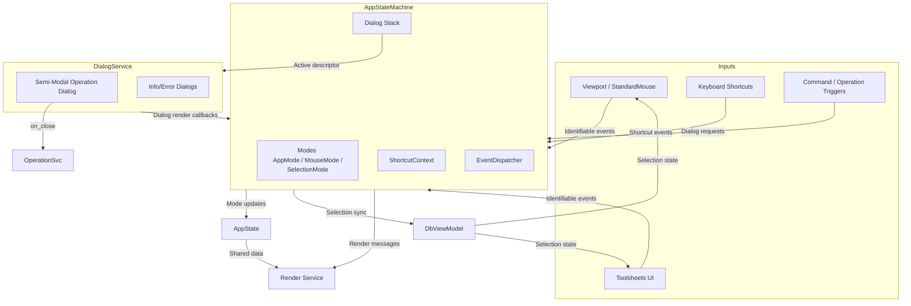

# App State Machine Architecture

## Interaction Flow Summary

- **Inputs** publish `InteractionEvent`s carrying `Identifiable` proxies into the `AppStateMachine` (`ASM`).
- `EventDispatcher` gives the active dialog descriptor first rights to consume events; unhandled events fall back to mode/selection logic.
- The dialog stack cooperates with `DialogService`: pushing a dialog submits a render closure; closing a dialog pops the stack and returns an `OperationDialogResult` to the operation service.
- `ShortcutContext` layers overrides so dialogs can temporarily capture keyboard shortcuts without losing global bindings.
- `DbViewModel` remains the single source of truth for selections; the machine syncs selection changes and informs both toolsheets and the viewport.
- `AppState` and the render service react to mode changes or preview requests emitted by the state machine (preview channel to be added later).
