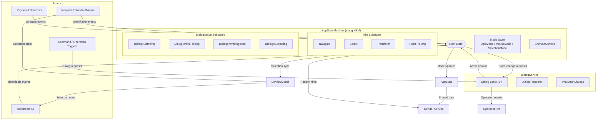

# App State Machine Architecture

## Interaction Flow Summary

- **Inputs** still emit `InteractionEvent`s built on `Identifiable` proxies. The statig-powered HSM receives them and first asks `DialogService` for the active dialog context (if any).
- **DialogService** owns the stack, renders dialog UIs, and exposes the top descriptor’s subscriptions, shortcut overrides, and state-change hooks via the context bridge. Dialog code can request mouse/selection mode changes or other actions through that bridge.
- **HSM structure**: the root state branches into idle substates (navigate/select/transform/pick) and dialog substates (listening/point-picking/awaiting/executing). Substates map to mouse modes or dialog workflows and can trigger transitions within their tree.
- **Event routing** lives inside the HSM: events go to the active dialog substate when subscribed; ignored events bubble to idle substates to maintain selection and navigation behavior.
- **ShortcutContext** layers overrides supplied by the active dialog while keeping global mappings when no dialog claims them.
- **DbViewModel** remains authoritative for selection state, ensuring both toolsheets and the viewport stay in sync regardless of the interaction source.
- **Operation completion** flows through `DialogService`: dialog results are forwarded to the operation service, and the next dialog on the stack becomes active automatically.
